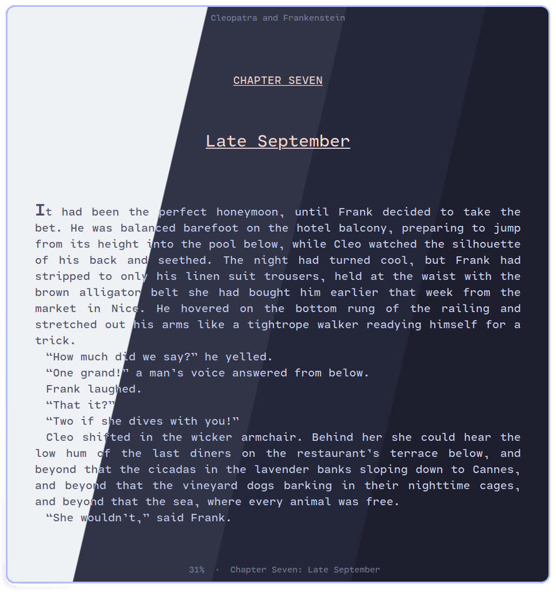
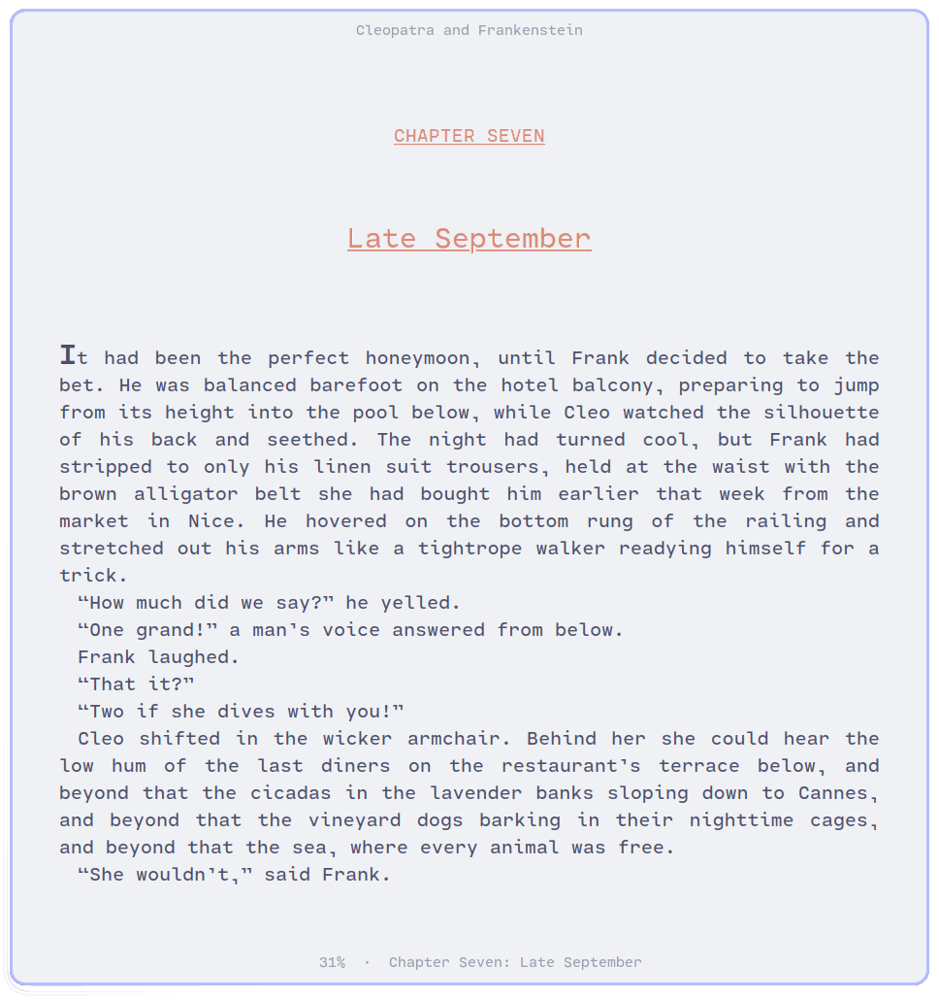
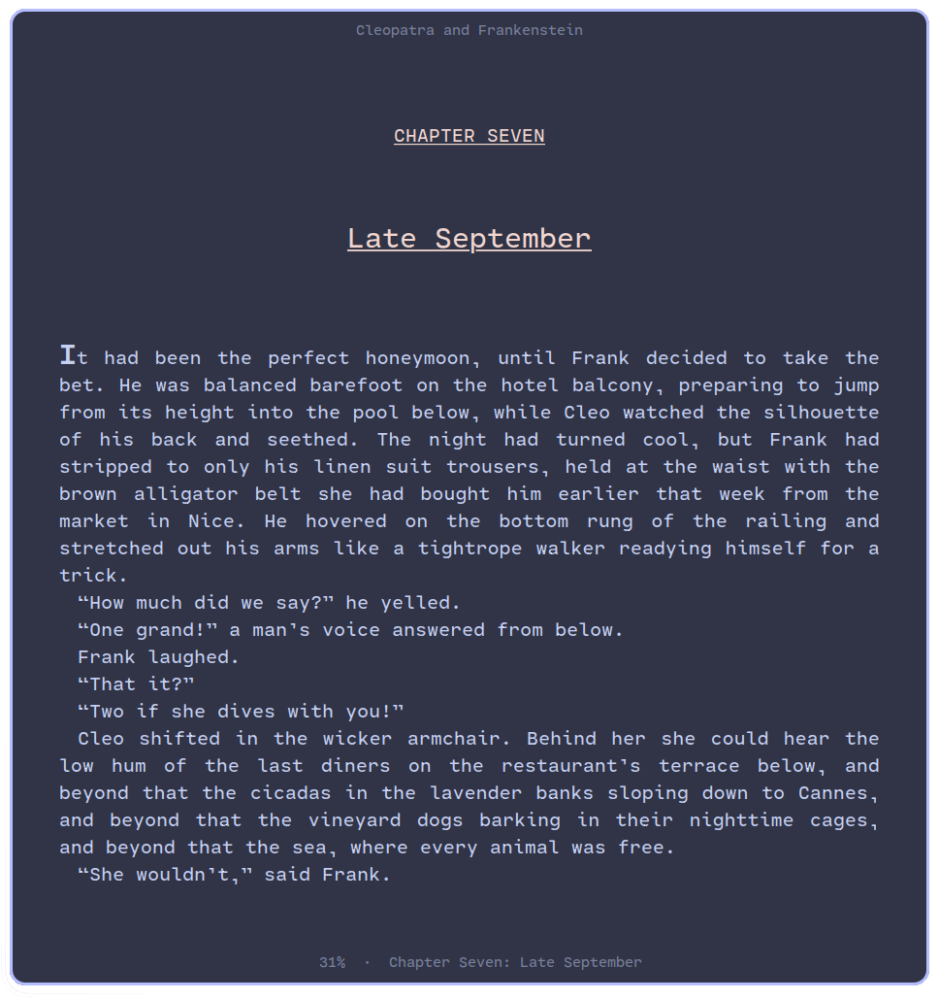
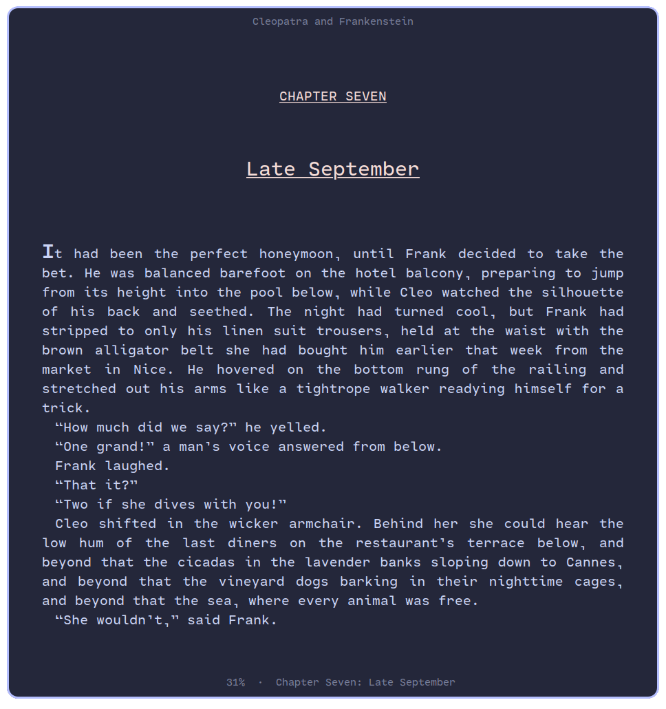
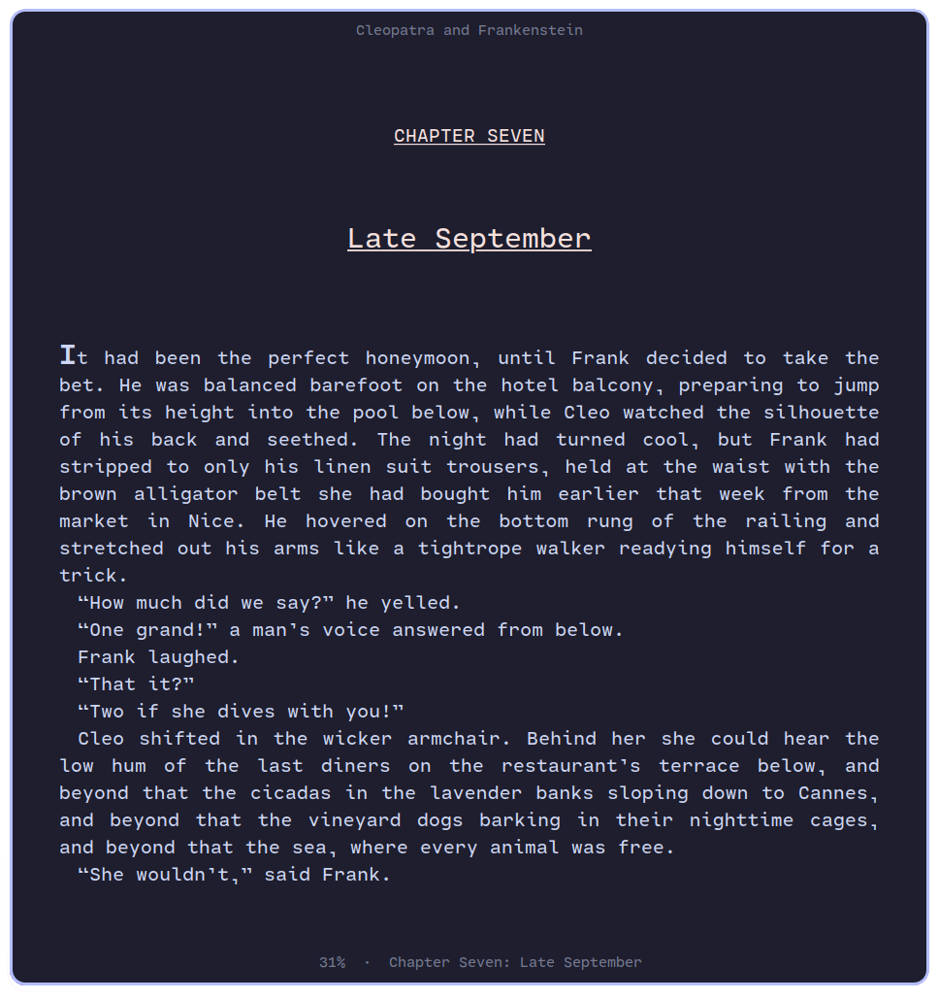

<h3 align="center">
	 
	
	Catppuccin for <a href="https://johnfactotum.github.io/foliate/">Foliate</a>
	
</h3>

	
	
	

	

## Previews

🌻 Latte

🪴 Frappé

🌺 Macchiato

🌿 Mocha

## Usage

### v2

1. Download/move the `themes.json` file to either `~/.config/com.github.johnfactotum.Foliate/` or `~/.var/app/com.github.johnfactotum.Foliate/config/com.github.johnfactotum.Foliate/` if you are using the Flatpak version of the app.
2. Select your desired flavor from Foliate's in-app settings.

### v3

- Download/move the flavor file(s) of your choice from [`themes/`](./themes/) to either `~/.config/com.github.johnfactotum.Foliate/themes/` or `~/.var/app/com.github.johnfactotum.Foliate/config/com.github.johnfactotum.Foliate/themes/` if you are using Flatpak version of the app.

## 💝 Thanks to

- [ghostx31](https://github.com/ghostx31)
- [ʟɪᴍᴇ@ᴠᴏɪᴅ](https://github.com/lime-desu)

&nbsp;

	

	Copyright &copy; 2021-present <a href="https://github.com/catppuccin" target="_blank">Catppuccin Org</a>

	

